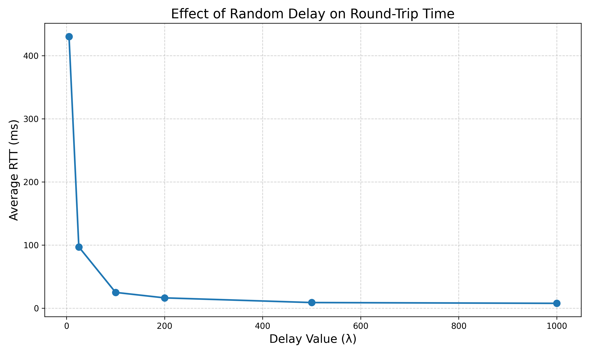

# tos-covert-channel

A covert communication channel hidden in the IP **Type of Service (TOS)** header
field, together with an inline middlebox that detects it and then scrubs it out.
Four pieces — a sender, a receiver, a heuristic detector, and an active
mitigator — plus the measurements taken from each.

> **Attribution.** This is coursework built *on top of* the
> [cengwins/middlebox](https://github.com/cengwins/middlebox) development
> environment. The testbed — the `sec` / `insec` / `mitm` container topology, the
> NATS message bus that hands packets to a processor, the MITM switch, and the
> Prometheus/Grafana plumbing — **is theirs, not mine.** This repository contains
> only the files I wrote, which plug into that environment. The sender and the
> receiver do run on their own over loopback; the detector and the mitigator need
> that testbed, because they read packets off its NATS bus. See
> [Running](#running) for both paths. Upstream is GPL-3.0 and so is this.

## What it is

The IP TOS byte is a header field that routers are free to rewrite and that
almost nobody inspects. That makes it a serviceable place to smuggle data.

**Sender** (`code/sec/tos_covert_sender.py`) encodes a message as 8-bit ASCII,
splits the bit string into *n*-bit symbols (`--tos-mapping-bits`, default 3),
and writes one symbol into the TOS field of each outgoing UDP packet. A session
is framed as:

```
START × 3   →   header symbols   →   payload symbols   →   END × 3
```

The header is a **length prefix**: 16 bits, rounded up to a whole number of
symbols, carrying the count of payload symbols that follow. That is what lets
the receiver know when a message is complete rather than guessing from a
delimiter that might collide with data. Each symbol can be sent more than once
(`--packets-per-symbol`) for redundancy.

**Receiver** (`code/insec/tos_covert_receiver.py`) sniffs the UDP port with
Scapy and runs a `waiting → header → payload → complete` state machine. Where
redundancy is on, it takes the majority value across the copies of each symbol.
On completion it decodes the payload back to text and reports channel
**capacity** — payload bits divided by elapsed wall-clock time — averaging over
messages with a 95 % confidence interval.

**Detector** (`code/python-processor/simple_detector.py`) sits inline in the
middlebox, subscribing to the NATS packet subjects and republishing every packet
onward, so it observes without interrupting. It flags a packet through two
independent layers:

- a *payload* layer matching the literal `START` / `HEADER` / `DATA` / `END`
  markers this sender writes, and
- a *statistical* layer over a rolling 50-packet window of TOS values, firing
  when Shannon entropy exceeds 0.3, variance exceeds 5, or more than 10 of the
  values are non-zero.

It scores itself as it runs, keeping a TP/FP/TN/FN confusion matrix and printing
precision, recall and F1 every five seconds.

**Mitigator** (`code/python-processor/simple_mitigator.py`) uses the same two
layers, but instead of only reporting it rewrites `IP.tos` to 0 on every flagged
packet before forwarding. Overt traffic passes through untouched; the covert
symbols are erased in flight. Because the length-prefix header is scrubbed along
with everything else, the receiver never learns how many payload symbols to
expect and the session aborts outright.

**Delay processor** (`code/random-delay-processor/processor.py`) is the
groundwork step: a middlebox function that holds each packet for an
exponentially distributed interval (`random.expovariate(DELAY_VALUE)`) before
forwarding. It exists to confirm the middlebox can perturb traffic at all, and
to calibrate the testbed.

## Results

All figures below are from my own measurement runs on this testbed.

### Delay processor — RTT against the delay parameter

`ping`, 50 packets per configuration, 0 % loss throughout. The mean hold time
is 1/λ.

| λ | Mean hold (ms) | Avg RTT (ms) | Min / Max (ms) | mdev |
|------:|------:|------:|------:|------:|
| 5 | 200.0 | 430.32 | 49.41 / 1306.38 | 249.95 |
| 25 | 40.0 | 96.95 | 6.06 / 306.45 | 66.36 |
| 100 | 10.0 | 24.91 | 8.97 / 69.40 | 13.65 |
| 200 | 5.0 | 16.24 | 6.52 / 33.28 | 7.31 |
| 500 | 2.0 | 8.83 | 5.52 / 18.87 | 3.18 |
| 1000 | 1.0 | 7.60 | 4.00 / 11.37 | 1.63 |



RTT tracks the injected mean closely, and the spread (`mdev`) grows with it —
an exponential hold with a large mean produces heavy-tailed latency, which is
exactly what shows up in the 1306 ms maximum at λ = 5.

### Covert channel — capacity

Capacity rises with symbol width and with send rate, and falls with redundancy,
which is the expected three-way trade-off: wider symbols mean fewer packets per
message, and every redundant copy buys reliability with time. At its most
aggressive setting the channel reached roughly **130 bit/s**. The configuration
used for the detection and mitigation experiments below is the more realistic
`--tos-mapping-bits 3 --interval 0.1` with no redundancy, which sustains about
**18.6 bit/s**.

### Detector — quality metrics

Five runs per scenario, 95 % confidence intervals:

| Scenario | Precision | Recall | F1 |
|---|---|---|---|
| A — Standard | 0.952 ± 0.019 | 1.000 ± 0.000 | 0.975 ± 0.010 |
| B — Stealthy (1-bit symbols, long interval) | 0.975 ± 0.010 | 1.000 ± 0.000 | 0.989 ± 0.006 |
| C — High-speed | 0.905 ± 0.027 | 1.000 ± 0.000 | 0.949 ± 0.018 |
| D — Stress (mixed background traffic) | 0.908 ± 0.022 | 0.974 ± 0.011 | 0.939 ± 0.014 |

Recall stays at or above 0.97 everywhere, and precision never drops below 0.90.
The detector needs no training phase and no stored model — it is thresholds over
a 50-packet window.

### Mitigator — residual capacity

| Scenario | Mean capacity (bit/s) | 95 % CI | Reduction |
|---|---:|---|---:|
| Baseline, no mitigation | 18.55 | [17.92, 19.18] | — |
| Isolated traffic | 0.22 | [0.06, 0.39] | 98.8 % |
| Mixed traffic | 0.94 | [0.48, 1.40] | 94.9 % |
| Heavy traffic | 0.00 | [0.00, 0.02] | 100 % |

Under heavy load all five runs timed out with zero payload decoded: the flood of
benign UDP drives window entropy past the threshold, so effectively every packet
is scrubbed. Overt traffic was forwarded intact throughout.

## Running

There are two ways in. **Standalone** needs nothing but Python and a minute, and
exercises the covert channel end to end. **Full testbed** brings up the upstream
middlebox and is the only way to run the detector and the mitigator, since both
of them read packets off the NATS bus rather than off a wire.

### Standalone — sender and receiver only

Both sides run on one Linux host and talk over the loopback interface. Scapy
builds raw packets and sniffs the wire, so both need root.

```bash
pip install scapy
```

Terminal 1 — receiver, sniffing loopback:

```bash
sudo python3 code/insec/tos_covert_receiver.py --iface lo --tos-mapping-bits 3
```

Terminal 2 — sender, aimed at localhost:

```bash
sudo python3 code/sec/tos_covert_sender.py --target-ip 127.0.0.1 --tos-mapping-bits 3 --message "HELLO"
```

The receiver walks its state machine as the packets land, then prints the
decoded string and the capacity it measured:

```
START sinyali alındı. HEADER durumuna geçiliyor.
Header alındı. 14 payload sembolü bekleniyor.

Alınan ve çözümlenen mesaj:
HELLO
Mesaj süresi: … saniye, Kapasite: … bit/s
```

Fourteen is not arbitrary: `HELLO` is 5×8 = 40 bits, padded to 42 so it divides
by the 3-bit symbol width, giving 14 symbols. Change `--tos-mapping-bits` and
that number moves with it. The receiver keeps listening afterwards and exits on
its own after `--timeout` seconds (180 by default), printing a mean and 95 %
confidence interval over every message it decoded.

If the receiver never prints anything, it is usually Scapy rather than the
channel: on some versions the default layer-3 socket will not put packets onto
`lo`. Add one line under the Scapy import in `code/sec/tos_covert_sender.py` and
try again:

```python
conf.L3socket = L3RawSocket
```

### Full testbed — detector and mitigator

You need a working checkout of the upstream environment first:

```bash
git clone https://github.com/cengwins/middlebox.git
cd middlebox
```

Copy this repository's `code/` and `dockers/` trees over it, then apply the two
upstream edits described in [`integration/`](integration/): the service block in
`docker-compose.snippet.yml` and the one-line Scapy additions in
`Dockerfile.patch.md`. Upstream supplies its own `.env`; the variables this code
reads are listed in [`.env.example`](.env.example). **Do not commit a real
`.env`** — it carries the NATS credentials.

```bash
docker compose up -d
```

Then, in three terminals:

```bash
# receiver, on the insecure host
docker exec -it insec python3 /code/insec/tos_covert_receiver.py \
    --tos-mapping-bits 3 --iface eth0

# detector (or simple_mitigator.py), inline in the middlebox
docker exec -it python-processor python /code/python-processor/simple_detector.py

# sender, on the secure host
docker exec -it sec python3 /code/sec/tos_covert_sender.py \
    --message "HELLO" --tos-mapping-bits 3 --interval 0.1
```

### Reproducing the delay plots

To reproduce the delay plots, run the ping campaign against each `DELAY_VALUE`,
save the output as `<λ>.txt`, and from `analysis/`:

```bash
python analyze.py     # RTT against λ            -> delay_analysis.png
python analyze2.py    # RTT against mean hold    -> mean_delay_rtt_analysis.png
```

Both scripts glob `*.txt` in the working directory, so run them from inside
`analysis/`. The six measurement files from my runs are committed there.

## Status & caveats

- **The payload layer is an oracle, not a technique.** Matching the literal
  `START` / `DATA` markers only works because this sender writes them in
  cleartext. A real adversary would not. The statistical layer — entropy and
  variance over the TOS window — is the part that generalises, and the honest
  reading of the metrics above is that they measure the two layers combined.
- **Thresholds are static.** Entropy > 0.3, variance > 5 and the non-zero count
  are hand-tuned against this testbed's traffic. On a network where QoS markings
  are actually in use, the baseline TOS distribution is not near-constant zero
  and these numbers would need to be re-derived.
- **Detector and mitigator count "unusual" slightly differently.** The detector
  counts non-zero values across the whole 50-packet window; the mitigator counts
  them over the last 20. Both were tuned as they stand, but they are not
  identical predicates.
- **Normalising to 0 is detectable.** Forcing TOS to exactly zero tells an
  attacker that a scrubber is present. Substituting plausible DSCP values would
  hide the mitigation itself; that is not implemented here.
- **Language.** Console output and comments in the sender and receiver are
  largely in Turkish.

## License

GPL-3.0, inherited from the upstream middlebox environment — see
[LICENSE](LICENSE).
